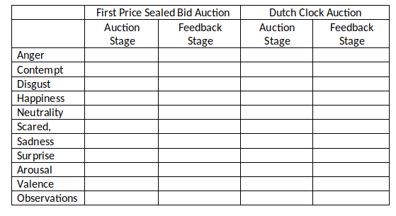

```{r setup, include=FALSE}
options(scipen=0)
library(data.table)
library(stringr)
library(knitr)
library(ggplot2)
library(stargazer)
knitr::opts_chunk$set(echo = TRUE)
source_files<- list.files(path = '~/Documents/Github/auction_emotions/R', recursive = TRUE, full.names = TRUE)
tmp <- lapply(source_files, source)

```
\clearpage

# Background 

Lowenstein (2000) argues that economists should consider the role that visceral emotions play in impacting decision making.  
Emotions in other areas like asset markets.  

Turn to questions about auction formats that are isomorphic.

Some of the literature on emotions in auctions.  
Adam, Krämer, and Weinhardt (2013) use galvanic skin response and heart rate to measure excitement and find fast clocks are more excited and remain in the bidding process longer.  They also find that losing is felt more strongly than winning.  Astor, Adam, Jähing, and Seifert (2013) conduct similar analysis on bidders in first price auctions and find that the joy of wining is stronger than the pain of losing.  Somewhat surprisingly, the two papers do not compare behavior between the two theoretically isomorphic auction formats despite the two papers having many co-authors in common.  Astor, Adam, Jähing, and Seifert (2013) also provide a review of studies comparing joy of wining to pain of losing.    
Smith and Dickhaut (2005) collect heart rate information during English and Dutch auctions.  Recording the heart rate does not appear to impact prices.  Heart rate does help predict bidding behavior in Dutch auctions but not in English auctions.   

# Experimental Design

We employ a within-subjects design to compare the emotional patterns associated with bidding in first price sealed bid auctions and Dutch clock auctions when bidders have independent private values.   Subjects in the experiment bid in 25 first price and 25 Dutch clock auctions with the order varied to control for sequence effects.\footnote{The order varied with the session.  In half of the sessions subjects competed in 25 first price auctions and then 25 Dutch clock auctions and in the other half the order was reversed.}

In each auction, the $n = 4$ bidders each received a value drawn randomly from the set [0, 8, 16, 24  … 224, 232, 240].  In the first price auction, each bidder submits a private bid and the person submitting the highest bid is the winner with ties broken randomly.  Once the winner is determined, all the bidders in the auction are informed of the winning bid.  The winner earns her value minus her bid and the other bidders earn 0.  In the Dutch clock auction an initial price is set.  This price is reduced at regular intervals until some bidder ends the auction by agreeing to pay the currently stated price.  Once this occurs, the results are revealed.  The bidder who stopped the clock is the winner and receives a profit equal to his value minus the price at which he stopped the auction.  The other bidders all earn zero.  Once an auction ends, the bidders receive new value draws and another auction begins. 

In our experiments the starting price for the Dutch clock was set at 240, the highest possible value a bidder could draw.  The price then dropped by 3 every half second.  Katok and Kwasnica (2008) and Adam, Krämer, and Weinhardt (2013) have shown that clock speed influence bidding behavior and excitement in Dutch auctions.  Our clock speed and decrement are comparable to the exciting versions of Dutch auctions in those papers.  Because of these parameters, prices in the Dutch auction must be from the set [0, 3, 6, 9  … 234, 237, 240].  To maintain parallelism between the auction formats, we also restrict bids in the first price auction to be from this set. 

A fundamental theoretical result is that the first price and Dutch clock auctions are isomorphic.  Under the assumption that bidders are risk neutral, the equilibrium bid as function of value, $b(v)$ in either auction format is $b(v) = \frac{n-1}{n}v = \frac{3}{4}v$.  Given the equilibrium bid function, the set of possible bids includes the equilibrium bid for any value that a subject might draw.   The distribution of possible values and the clock decrement were selected so as to ensure this relationship held given n.    As a result, the expected price in these auctions is 144 and the expected profit of the winner is 48.  While this isomorphism holds in theory, behaviorally the Dutch auction tends to generate lower prices (see Coppinger, et al 1980; Cox, Roberson, and Smith, 1982; Deck, Lee, and Reyes, 2015).\footnote{Recent work by Deck and Wilson (2018) has found that behavior in the two auctions is similar when subjects use a graphic interface to gain considerable experience over 750 auctions.}

To capture the emotional responses of the subjects, each person was recorded using a web camera positioned over their computer terminal.  The camera captured video of the subject throughout the entire experiment, which was programed in ztree (Fischbachr, 2007).  Figure 1 shows the sequence of events in an experimental session.  The experiment was structured to resemble the timeline of previous auction experiments like Deck, Lee, and Reyes (2015).


After the experiment concluded, Noldus software was used to identify facial expressions.  The software analyzes a subject’s face approximately 30 times per second.  Specifically, the software scores each image for anger, contempt, disgust, happiness, neutrality, scared, sadness, and surprise.  Each of these emotions is scored on a 0 to 1 scale.  Faces are also measured for arousal, which is associated with the intensity of emotion on a 0 to 1 scale, and for valence, which is the an overall measure of positive or negative emotion on a -1 to 1 scale.  

A total of 172 subjects completed the study in one of 8 sessions.  Each session included between 12 and 24 subjects. Within a session subjects were placed in to smaller auction groups consisting of four people and only interacted with that group over the course of the experiment as is typical in auction experiments. The subjects were undergraduate students at Chapman University who had volunteered to be in the Economic Science Institute’s subject pool for economic experiments. Subjects were recruited for a 90 minute study and were paid \$7 for participating in addition to their salient earnings.  All monetary amounts in the experiment are denoted in francs, which were converted at the rate of 50 francs equals $1.00.  This rate was common information at the beginning of the experiment and all earnings were paid in private at the end of the session. The average salient payment was \$XX.XX.   
# Results

## Bidding

We begin by providing the traditional analysis of behavior in the 2150 auctions that we observed. The average price in the first price auctions was XXX and the average observed price in the Dutch clock auctions was XXX.  While both of these averages are statistically different from the theoretically predicted value of 144 (p-values of XXX and XXX for the first and Dutch# auctions, respectively), the two averages are not statistically different from each other (p-value  = XXXX).  Figure 2 shows the distribution of observed bids conditional on value.  For the first price auction the figure includes all bid, but for Dutch auction only the winner’s bid is observable and thus left portion of the figure is based on very few observations for the Dutch auction.  For both auction formats, the observed bids tend to lie above the risk neutral equilibrium level, consistent with moderate risk aversion (see Cox, Roberson, and Smith, 1982).  But contrary to the usual finding that people place lower bids in Dutch auctions, Figure 2 indicates that conditional on their value draw subjects tend to place similar bids in both auctions.\footnote{In a field experiment, Lucking-Reiley (1999) found that prices were higher with Dutch auctions, but in light of the work by Katok and Kwasnica (2008) and Adam, Krämer, and Weinhardt (2013) that result is likely due to the extremely slow clock speed that changed over days rather than seconds.} This similarity is supported statistically by the following test:

```{r, results='asis', echo=FALSE}
dt_type <- analysis_auction_order_and_type()$auction_type
kable(dt_type)
```


While the dutch and first price auction do not show differences in aggregate, there are substantial differences based upon auction order, auction sequence and auction type. These results are shown in the following regression.

```{r, results='asis'}
l_results  <- analysis_auction_order_and_type()
#l_results <- lapply(l_results, function(x) stringr::str_replace_all(x, '\\_', ''))
# stargazer(l_results$regression_pctOfNash$Type, l_results$regression_pctOfNash$TypeNum, l_results$regression_pctOfNash$TypeOrderNum,
#                  title='Percent of Nash Bid Estimates')
regResults <- l_results$regression_pctOfNash$Type
stargazer(l_results$regression_pctOfNash$Type,
          l_results$regression_pctOfNash$TypeNum,
          l_results$regression_pctOfNash$TypeOrder,
          l_results$regression_pctOfNash$TypeOrderNum,
          covariate.labels=c("First Price Auction", "Auction Number", "Auction Order 2","First Price X Number","Auction Order 2 x Number","Constant"),
          omit.stat=c('LL', 'ser', 'f'), no.space=TRUE)
```
## Emotions

We now turn to our main focus, the analysis of the emotional responses of subjects in the auctions. Table 2 provides the average emotions during the auctions and while receiving feedback about the outcome for each auction institution.  The results indicate......



Subjects in the auctions rarely exhibit the following emptions:  contempt, disgust, sad, scared, surprise.  In the level of these emotions rarely exceeds 0.2 out of 1.  Therefore, we instead focus on anger, happiness, and neutrality which subjects do exhibit during the auctions along with valence and arousal.  Figures 3 through 7 plot the predicted emotional state for someone whose value has a 25% chance of being the highest in the auction (and thus is likely to lose) and someone whose value has a 75% chance of being the highest (and thus is likely to be a winner).\footnote{The probability that the other bidders all have a value below $x$ is $\left(\frac{x}{240}\right)^3$ .} Each point on these plots is based on a separate regression analysis of the average emotional level of all bidders over the last half-second given the elapsed time since the auction stage began and includes a constant and the probability of being the highest bidder as explanatory variable conducted.  Thus, for the sixteen second mark on the x-axis which corresponds to the expected duration of the Dutch auction since the price hits 144 at that time, the regression analysis is based on the average emotion expressed when the auction has been running for between 15.5 and 16 seconds.  Because the auction phase ends once the auction results are determined, the number of observations undergirding the regressions represented in Figures 3-7 are decreasing as the elapsed time increases.     

