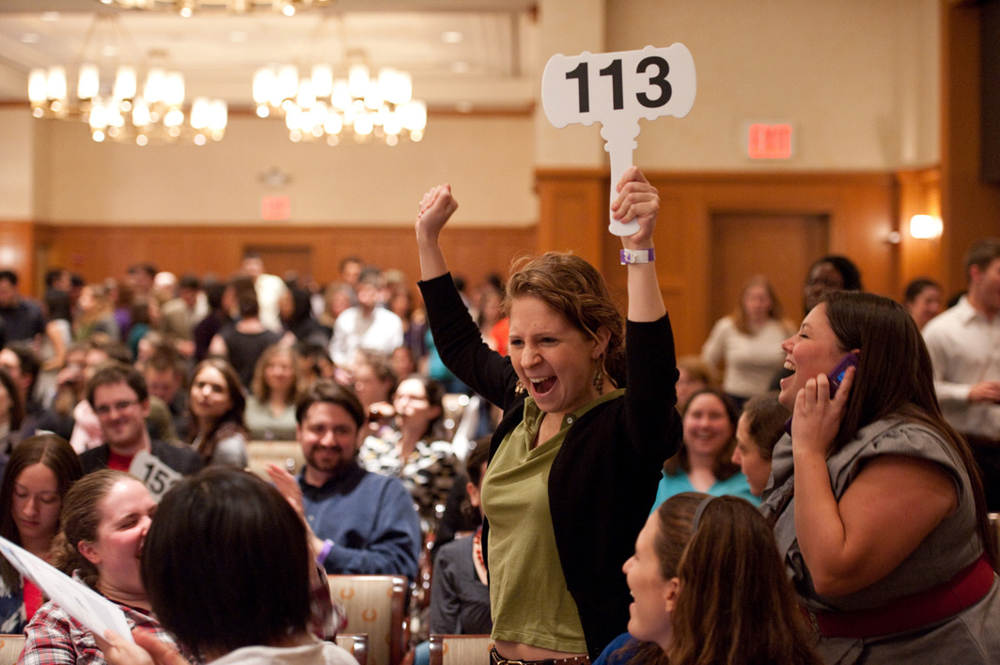
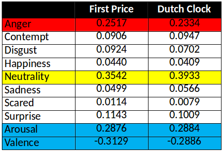
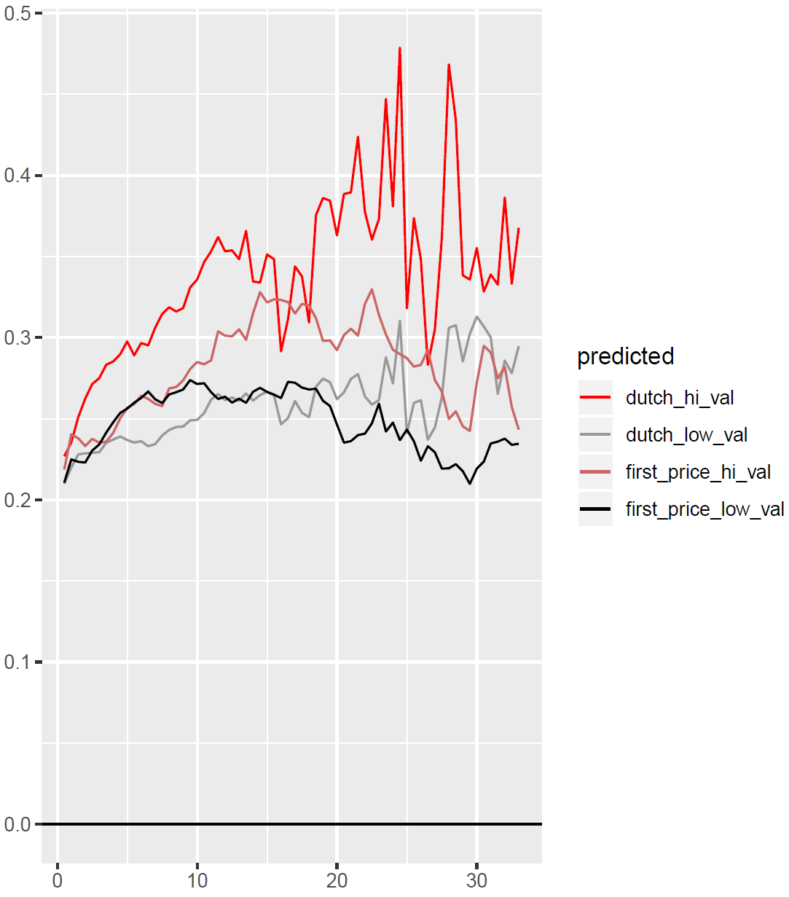

```{r setup, include=FALSE}
knitr::opts_chunk$set(echo = FALSE)
```

# Outline

- Background Auction Theory and Predictions
- Experimental tests 
- The Role of Emotions

{width=250px}

# Auction Assumptions

- Seller auctioning item to a set of buyers (bidders)
- Bidders are competing to win an object
- There are $N$ players (bidders)
- Each bidder ($i$) has an intrinsic (true) value for the item being auctioned (will not bid or pay a higher price)
- Private Values: Each bidder knows only their value and not the values of others
- Only winner recieves the item and must pay bid price $b$

# Auction Types

- Ascending-bid (English Auctions)
- Descending-bid (Dutch Auctions)
- First-Price Sealed Bid Auctions
- Second-Price Sealed Bid Auctions (Vickery Auctions)

# Auction Types

## Ascending-bid auctions  (English auctions)

{width=150px}

- Carried out interactively in real time, with bidders present either physically or electronically.
- Seller gradually raises the price, bidders drop out until finally only one bidder remains
- Remaining bidder wins the object at this final price. 

# Auction Types

## Descending-bid (Dutch Auctions)

{width=150px}

- Interactive auction format
- Seller gradually lowers the price from some high initial value until
- First moment when some bidder accepts and pays the current price. 

# Auction Types

##  First-Price Sealed Bid Auctions 

{width=200px}

- Bidders submit simultaneous “sealed bids” to the seller. 
- Highest bidder wins the object and pays the value of her bid.

# Auction Types

## Second-price sealed-bid auctions (Vickrey Auctions)

{width=50px}

- Bidders submit simultaneous sealed bids to the seller
- Highest bidder wins the object and pays the value of the second-highest bid. 

Example: 

New Zealand, Radio Spectrum

# Auction Bid Strategies

- Bidders want to win items but are not willing to pay more than their value
- Difference between the amount paid and value is the bidder surplus
- Bid strategies the same in some of the auction types
    - Descending Bid and First-Price Auctions
    - Ascending Bid and Second-Price Auctions


# Auction Bid Strategies 

## Ascending Bid and Second-Price Auctions

- Winner of the auction is the last bidder remaining, and she pays the price at which the second-to-last bidder drops out.
- Should only drop out when the price exceeds your value. (Not before: Why?...)
- Implication: People should bid their true values. (Simple Nash Equilibrium)
- Pay the bid of the second-highest value...

# Auction Bid Strategies 

##  Descending Bid (Dutch) and First-Price Auctions

- Seller is lowering the price from its high initial starting point
- No bidder says anything until finally someone actually accepts the bid and pays the current price.
- Bidders therefore learn nothing while the auction is running, other than the fact that no one has
yet accepted the current price.
- For each bidder $i$, there’s a first price $b_i$ at which she’ll be willing to break the silence and accept the item at price $b_i$. \
- The process is equivalent to a sealed-bid first-price auction: this price $b_i$ plays the role of bidder $i$’s bid;
the item goes to the bidder with the highest bid value; and this bidder pays the value of her
bid in exchange for the item
- Optimal bid amount a function of your value and the number of other bidders, value distributions.... Why?

# Auction Bid Strategies

## Descending Bid (Dutch) and First-Price Auctions

### Nash Equilibrium

- Assume (Vickrey 1961) that all bidders are:
    1. Risk Neutral
    2. Draw their true values ($v_i$) from a uniform distribution
    3. Are certain only of their own values - and only the distribution of others.
    
- Then the Nash Equilibrium bid ($b_i$) for both Descending an First Price Auctions is:

\begin{equation}
b_i = \frac{N-1}{N}v_i
\end{equation}

# Descending Bid and First-Price Auctions

## Experimental Tests

\begin{quote}
Bids tend to be lower in Dutch auctions than in 1st price auctions despite
theoretical predictions that they should be identical (Coppinger et al 1980 and Cox et al 1982).
\end{quote}
 
## Why???? Role of Emotions...

# The Role of Emotions

- Smith and Dickhaut (2005) find that heart rate helps predict bidding in Dutch but not English auctions.  

- Adam et al (2011) use galvanic skin response and heart rate to learn bidders in auctions with fast clocks are more excited and remain in the bidding process longer.

- Astor et al (2013) measure galvanic skin response and heart rate and show that bidders in first price auctions find that the joy of winning is stronger than the pain of losing. 

- Breaban, Deck, Johnson: Examine role of emotions in an experimental setting

# Breaban, Deck, Johnson

## Experimental Design

- Subjects complete 25 first price and 25 Dutch auctions
    - Fixed group of N=4 bidders
    - Different auction order blocks
    - Examine \emph{within subject design}
- Sessions at Chapman University
    - 8 sessions with 12-24 subjects per session
    - 172 subjects
    - 90 minute study: paid \$7 flat + \$10.09 (average)
    
# Breaban, Deck, Johnson

## Market Parameters

Values drawn with equal probability from \[0, 8, 16, …, 232, 240\]
Given $N=4$, risk neutral equilibrium bid is $\frac{3}{4}v_i$

- Dutch Clock Starting Price = 240
- Dutch Clock Tick Increment = 3
- Dutch Clock Speed = 0.5 second
        
Bids in 1st Price were restricted to [0, 3, 6, 9, 12, …., 237, 240] 

# Session 


# Face Reader

- Noldus analyzes face 30 times/sec (big, big, dataset)
- 7 human emotions (scored 0 - 1)
1. Anger
2. Contempt
3. Disgust
4. Happiness
5. Scared
6. Sadness
7. Surprise

- Neutrality: Absence of other emotions
- Valence: Positiveness of Emotions (-1 to 1)
- Arousal: Intensity of Emotions (0 to 1)

# Face Reader


# Auction Results


# Auction Results


# Auction Results
\begin{table}
\begin{tabular}{c|llll}
& Estimate & Standard Error & t-statistic & p-value \\
\hline
constant & 40.54 & 14.502 & 2.80 & 0.027 \\
Value & 0.67 & 0.073 & 9.19 & <0.001 \\
Dutch & -17.63 & 20.438 & -0.86 & 0.417 \\
Value $\times$ Dutch & 0.09 & 0.10 & 0.87 & 0.412 
\end{tabular}
\caption{Comparison of Winning Bids by Auction Type}
\end{table}

\begin{table}
\begin{tabular}{c|llll}
& Estimate & Standard Error & t-statistic & p-value \\
\hline
constant & -0.75 & 1.358 & -0.55 & 0.599 \\
Value & 0.85 & 0.011 & 74.92 & <0.001  
\end{tabular}
\caption{All bids in First Price Auctions}
\end{table}

# Emotional Responses

{width=300px}


# Emotional Responses

{width=400px}

# Emotional Responses

{width=400px}

# Emotional Responses

{width=200px}

# Emotional Responses

{width=200px}

# Emotional Responses

{width=200px}

# Emotional Responses


# Emotional Responses


# BDJ Conclusions

1. Subjects do not like being in auction experiments.
2. Dutch auctions make people angrier, especially as their values are high and/or the auction runs. 
3. In 1st price auctions higher values lead to more anger as well.
4. High value bidders become much happier as the Dutch auction runs.  Low value bidders do as well, but to a lesser degree.
5. After the auction, in-the-money losers are sad in both formats but those in the Dutch are angrier and less surprised. In-the-money winners are less disgusted and those in the Dutch are angrier.  

# Overall Conclusions

1. Reproducibility....
2. Always an interesting way to examine your data...
3. Questions/Discussion???